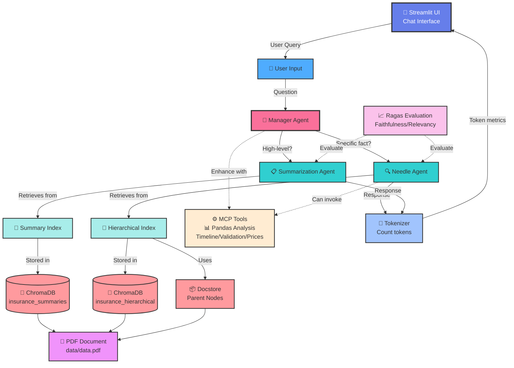

# 🚀 Multi-Agent RAG Retrieval System

A production-grade multi-agent RAG system with hierarchical retrieval, interactive visualization, and comprehensive evaluation. Generic framework applicable to any document analysis domain.

## 🎯 Key Features

- **Multi-Agent Architecture**: Manager, Needle, and Summary agents with intelligent routing
- **Hierarchical Retrieval**: 3-level auto-merging chunks (256/512/1024 tokens)
- **Interactive UI**: Streamlit chat interface with live TradingView-style charts
- **Flexible Storage**: ChromaDB
- **Statistical Tools**: Deterministic calculations with optional ReAct agent pattern
- **LLM-as-Judge**: Comprehensive evaluation framework
- **MCP Integration**: Model Context Protocol for extended capabilities

## System Architecture



## 📊 Interactive Visualization

Full-year **TradingView-style charts** with:
- Candlestick patterns with volume bars
- Dynamic markers on query-relevant data points
- Real-time highlighting based on chat queries

## Component Overview

### 🎨 Streamlit UI
- **Purpose**: Interactive chat interface for user queries
- **Features**:
  - Real-time chat with message history
  - Token usage visualization
  - Example query buttons
  - Settings sidebar
- **Technology**: Streamlit web framework

### 🧠 Manager Agent (Router)
- **Purpose**: Routes queries to the appropriate specialized agent
- **Logic**: 
  - Keywords like "overview", "high-level" → Summarization Agent
  - Specific factual queries → Needle Agent
- **Additional**: Invokes MCP tools when needed

### 🔍 Needle Agent
- **Purpose**: Handles precise factual queries ("needle in haystack")
- **Uses**: Hierarchical Index with Auto-Merging Retriever
- **Features**:
  - Vector similarity search
  - Retrieves small chunks (256 tokens)
  - Auto-merges to parent nodes when needed
  - Lost-in-the-middle mitigation (keeps first 3 + last 3)

### 📋 Summarization Agent
- **Purpose**: Answers high-level overview questions
- **Uses**: Summary Index
- **Features**:
  - Processes all documents
  - No vector search needed
  - Fast document-level summaries

### 🔢 Tokenizer 
- **Purpose**: Tracks and reports token usage
- **Features**:
  - Uses Ollama API metadata for accurate counts
  - Tracks prompt, completion, and context tokens
  - Calculates tokens/second performance
  - Displays in Streamlit UI
- **Fallback**: Word-based approximation when metadata unavailable

## Data Management & Indexing

### 📚 Hierarchical Index

**Chunking Strategy:**
```
Large (1024 tokens)
  └── Medium (512 tokens)
        └── Small (256 tokens)
```

**Rationale:**
- **1024**: Broad context for document-level understanding
- **512**: Balanced granularity for section-level retrieval
- **256**: Fine-grained for precise fact extraction

**Overlap:** 4 tokens between chunks to preserve context continuity

**Why Auto-Merging?**
- Starts with precise small chunks
- Automatically merges to parent when more context needed
- Prevents information fragmentation

### 📄 Summary Index

- Stores entire documents with metadata
- No chunking or vector search
- Direct LLM processing for overviews
- Metadata includes: doc_type, timestamp, entities

## Storage Layer

### 💾 ChromaDB (Vector Store)
```
./chroma_storage/
  ├── insurance_hierarchical  (for Needle Agent)
  └── insurance_summaries     (for Summarization Agent)
```

**Why ChromaDB?**
- Persistent vector storage
- Fast similarity search
- Supports multiple collections

### 📦 Docstore
```
./storage/           (Hierarchical docstore)
./storage_summary/   (Summary docstore)
```

**Stores:**
- Parent nodes for hierarchical structure
- Document metadata
- Node relationships

## MCP Integration

### ⚙️ Claim MCP Tools (Enhanced with Pandas)

**1. Timeline Analysis**
```python
analyze_claim_timeline(text)
# Extracts dates and computes duration
```

**2. Document Validation**
```python
validate_required_documents(text, required_docs)
# Checks presence of required documents
```

**3. Price Range Extraction**
```python
extract_price_range(text)
# Extracts high/low prices from trading data
```

**4. Trading Pattern Analysis**
```python
analyze_trading_patterns(text)
# Uses Pandas to calculate:
# - Average price, volatility, price change %
# - Statistical analysis of trading data
```

**5. Moving Average Calculation**
```python
calculate_moving_average(text, window=5)
# Calculates moving averages and trend signals
```

**Trigger Mechanism:**
- Manager checks query keywords
- Invokes MCP if patterns match
- Enhances LLM response with structured data from Pandas analysis

## 🎯 Evaluation Methodology

### Dual Evaluation System

**1. Custom LLM-as-a-Judge**

Evaluates three key metrics:

- **Answer Correctness (0-10)**
  - Compares answer to ground truth
  - Evaluates factual accuracy
  - Uses separate LLM for unbiased scoring

- **Context Relevancy (0-10)**
  - Measures if retrieved contexts match query
  - Ensures retrieval quality
  - Validates semantic alignment

- **Context Recall (0-10)**
  - Checks if ground truth info exists in contexts
  - Validates retrieval completeness
  - Measures information coverage

**2. Ragas Framework**

Professional RAG evaluation with:

- **Faithfulness**: Is answer faithful to context?
- **Answer Relevancy**: Is answer relevant to question?
- **Context Recall**: Is ground truth in context?
- **Context Precision**: Is context relevant and precise?

**Benefits of Dual Evaluation:**
- Cross-validation between two evaluation methods
- Custom judge provides interpretable 0-10 scores
- Ragas provides industry-standard metrics (0-1)
- Comprehensive quality assessment

**Test Suite:** 8 queries covering:
- Needle queries (specific facts)
- Summary queries (high-level)
- MCP-enhanced queries (timeline/validation/analysis)

## Example Queries & Routing

| Query | Agent | Index | MCP |
|-------|-------|-------|-----|
| "What was the highest % increase?" | Needle | Hierarchical | ❌ |
| "Give high-level overview" | Summary | Summary | ❌ |
| "Timeline duration?" | Needle | Hierarchical | ✅ Timeline |
| "List missing documents" | Needle | Hierarchical | ✅ Validation |

## Limitations & Trade-offs

### Current Limitations:
1. **No true persistence** - Indexes rebuilt on each run
2. **In-memory docstore** - Not saved between runs
3. **Single PDF support** - No multi-document handling
4. **Fixed chunk sizes** - Not adaptive to content type

### Design Trade-offs:
1. **Fresh indexes vs Speed** - Chose correctness over speed
2. **Auto-merging overhead** - Better context vs slower retrieval
3. **MCP complexity** - More capabilities vs maintenance burden

### Future Improvements:
- [ ] True persistent storage (save docstore to disk)
- [ ] Multi-document support
- [ ] Adaptive chunking based on content
- [ ] Streaming responses for long queries
- [ ] More sophisticated MCP tools

## 🚀 Installation

### Prerequisites
- Python 3.10+
- Ollama running locally with models:
  - `gemma3:4b` (LLM)
  - `mxbai-embed-large` (embeddings)

### Setup

```bash
# Clone repository
git clone https://github.com/davidkern13/multiagent-rag-system
cd multiagent-rag-system

# Install dependencies
pip install -r requirements.txt

# Ensure Ollama is running
ollama serve
```

### Run Options

**1. Download data**
```bash
python generator/report.py
```

**1. Streamlit UI (Interactive Chat)**
```bash
streamlit run app.py
```
Opens browser at `http://localhost:8501` with chat interface

Runs predefined queries in terminal

**2. Evaluation**
```bash
set PYTHONPATH=%CD% && python evaluation/run_evaluation.py
```
Runs dual evaluation (Custom + Ragas) on test suite

## 📁 Project Structure
```
.
├── app.py                          # Main Streamlit UI with charts
├── agents/
│   ├── manager_agent.py            # Router
│   ├── needle_agent.py             # Precise queries + statistical tools
│   └── summarization_agent.py      # High-level summaries
├── core/
│   ├── embeddings.py               # Embedding model config
│   ├── llm_provider.py             # LLM config (temperature=0)
│   ├── tokenizer.py                # Token counting
│   └── system_builder.py           # System orchestrator
├── retrieval/
│   ├── hierarchical_retrieval.py   # 3-level auto-merging
│   ├── summary_retrieval.py        # Document-level index
│   └── metadata_extractor.py       # Metadata extraction
├── ingestion/
│   ├── indexing.py                 # Index builder
│   └── loader.py                   # PDF loader
├── generator/
│   └── report.py                   # Sample data generation
├── mcp/
│   ├── claim_mcp.py                # MCP orchestrator
│   └── claim_tools.py              # MCP tools
├── evaluation/
│   ├── judge.py                    # LLM-as-a-judge
│   ├── test_cases.py               # Test suite
│   └── run_evaluation.py           # Evaluation runner
├── data/
│   └── data.pdf                    # Source document
└── README.md                       # This file
```

 ## 🔬 Technologies

- **LlamaIndex**: Indexing & retrieval framework
- **ChromaDB**: Persistent vector database
- **Ollama**: Local LLM & embeddings (gemma3:4b, mxbai-embed-large)
- **Streamlit**:  Interactive UI
- **Ragas**: Professional RAG evaluation framework
- **Pandas**: Trading pattern analysis in MCP tools
- **Streamlit**: Interactive web UI for chat interface
- **PyMuPDF**: PDF document parsing
- **Python 3.10+**: Core programming language

---

**Author:** David Kern
**Course:** GenAI + Agents  
**Date:** December 2025