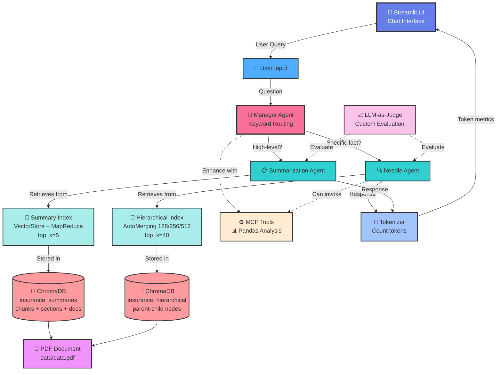

# 🚀 Multi-Agent RAG Retrieval System

Multi-Agent RAG Retrieval System with hierarchical retrieval, MapReduce summary index, and comprehensive evaluation. Generic framework applicable to any document analysis domain.

## 🎯 Key Features

- **Multi-Agent Architecture**: Manager, Needle, and Summary agents with intelligent routing
- **Hierarchical Retrieval**: 3-level auto-merging chunks (128/256/512 tokens)
- **MapReduce Summary Index**: Section and document-level summaries with top_k retrieval
- **Flexible Storage**: ChromaDB for persistent vector storage
- **Keyword-based Routing**: Fast and reliable query classification
- **LLM-as-Judge**: Custom evaluation framework
- **MCP Integration**: Model Context Protocol for extended capabilities

## System Architecture



## Component Overview

### 🎨 Streamlit UI
- **Purpose**: Interactive chat interface for user queries
- **Features**:
  - Real-time chat with message history
  - Token usage visualization
  - Example query buttons (statistical, date-specific, analytical)
  - Settings sidebar
- **Technology**: Streamlit web framework

### 🧠 Manager Agent (Router)
- **Purpose**: Routes queries to the appropriate specialized agent
- **Routing Strategy**: Keyword-based classification
  - Keywords: "overview", "summarize", "summary", "trend", "general", "overall", "broad"
  - Summary queries → Summarization Agent
  - All other queries → Needle Agent (default)
- **Benefits**: Fast, reliable, no LLM overhead
- **Additional**: Invokes MCP tools when needed

### 🔍 Needle Agent
- **Purpose**: Handles precise factual queries ("needle in haystack")
- **Uses**: Hierarchical Index with Auto-Merging Retriever
- **Retriever**: Pre-built with `top_k=40`
- **Features**:
  - Vector similarity search
  - Retrieves small chunks (128 tokens)
  - Auto-merges to parent nodes (256→512) when needed
  - Lost-in-the-middle mitigation (keeps first half + last half)
  - Statistical query detection for "highest", "lowest", "average"
  - Specialized prompts for max/min/average queries

### 📋 Summarization Agent
- **Purpose**: Answers high-level overview questions
- **Uses**: VectorStoreIndex with MapReduce structure
- **Retriever**: Built with `top_k=5` (only 5 most relevant contexts)
- **Features**:
  - Fast retrieval (cached in ChromaDB)
  - MapReduce nodes: leaf chunks + section summaries + document summaries
  - LLM condenses contexts to 2-3 sentences
  - Optimized for "trend", "overview", "general" queries

### 🔢 Tokenizer 
- **Purpose**: Tracks and reports token usage
- **Features**:
  - Uses Ollama API metadata for accurate counts
  - Tracks prompt, completion, and context tokens
  - Calculates tokens/second performance
  - Displays in Streamlit UI
- **Fallback**: Word-based approximation when metadata unavailable

## Data Management & Indexing

### 📚 Hierarchical Index (Needle Agent)

**Chunking Strategy:**
```
Large (512 tokens, overlap=20)
  └── Medium (256 tokens, overlap=20)
        └── Small (128 tokens, overlap=20)
```

**Rationale:**
- **512**: Broad context for document-level understanding
- **256**: Balanced granularity for section-level retrieval
- **128**: Fine-grained for precise fact extraction (optimized for "needle in haystack")

**Overlap:** 20 tokens between chunks to preserve context continuity

**Why Auto-Merging?**
- Starts with precise small chunks (128 tokens)
- Automatically merges to parent when more context needed
- Prevents information fragmentation
- Optimal for statistical queries requiring comparison across data points

**Top-k:** Set to 40 at index build time for comprehensive retrieval

### 📄 Summary Index (Summarization Agent)

**Chunking Strategy:**
```
Chunks: 512 tokens, overlap=4
```

**MapReduce Structure:**
1. **Leaf chunks** (512 tokens) - Original text segments
2. **Section summaries** - Groups of 5 chunks combined
3. **Document summaries** - First 3 chunks of each document

**How it works:**
1. Documents split into 512-token chunks during indexing
2. Section summaries created by combining chunks
3. Document summaries from first chunks
4. All stored as nodes in VectorStoreIndex
5. At query time, retrieves top 5 most relevant nodes (top_k=5)
6. SummarizationAgent condenses to 2-3 sentences

**Benefits:**
- **Fast**: Pre-built summaries, no real-time generation
- **Cached**: Stored in ChromaDB, loaded instantly
- **Concise**: top_k=5 limits context, LLM produces 2-3 sentences
- **Scalable**: Works well even with large documents

**Metadata:** doc_type, timestamp, entities (JSON string)

## Storage Layer

### 💾 ChromaDB (Vector Store)
```
./chroma_storage/
  ├── insurance_hierarchical  (Needle: 128/256/512 chunks)
  └── insurance_summaries     (Summary: MapReduce nodes)
```

**Why ChromaDB?**
- Persistent vector storage
- Fast similarity search
- Supports multiple collections
- Easy integration with LlamaIndex

### 📦 Docstore
```
./docstore_hierarchical/   (Hierarchical node structure with parent-child)
./docstore_summary/        (Summary nodes with MapReduce structure)
```

**Stores:**
- Parent nodes for hierarchical structure
- Document metadata
- Node relationships
- Section and document summaries

## MCP Integration

### ⚙️ Claim MCP Tools (Enhanced with Pandas)

**1. Timeline Analysis**
```python
analyze_claim_timeline(text)
# Extracts dates and computes duration
```

**2. Document Validation**
```python
validate_required_documents(text, required_docs)
# Checks presence of required documents
```

**3. Price Range Extraction**
```python
extract_price_range(text)
# Extracts high/low prices from trading data
```

**4. Trading Pattern Analysis**
```python
analyze_trading_patterns(text)
# Uses Pandas to calculate:
# - Average price, volatility, price change %
# - Statistical analysis of trading data
```

**5. Moving Average Calculation**
```python
calculate_moving_average(text, window=5)
# Calculates moving averages and trend signals
```

**Trigger Mechanism:**
- Manager checks query keywords
- Invokes MCP if patterns match
- Enhances LLM response with structured data from Pandas analysis

## 🎯 Evaluation Methodology

### Custom LLM-as-a-Judge

Evaluates three key metrics matching assignment requirements:

**A. Answer Correctness (0-5)**
- Compares answer to ground truth
- Evaluates factual accuracy
- Checks for matched facts vs missed facts
- Uses separate LLM for unbiased scoring

**B. Context Relevancy (0-5)**
- Measures if retrieved contexts match query
- Ensures retrieval quality
- Validates semantic alignment
- Counts relevant vs irrelevant contexts

**C. Context Recall (0-5)**
- Checks if ground truth info exists in contexts
- Validates retrieval completeness
- Measures information coverage
- Verifies expected chunks are present

**Scoring:**
- Each metric: 0-5 points
- Overall score: Sum of 3 metrics (0-15)
- Final percentage: (overall/15) × 100

**Test Suite:** 8 queries covering:
- Needle queries (specific facts, dates)
- Statistical queries (highest, lowest, average)
- Comparison queries (first week vs last week)
- Summary queries (overview, trends)

**Output:** `evaluation_results.json` with detailed scores and statistics

## Example Queries & Routing

| Query | Agent | Index | Top-k | Routing Reason |
|-------|-------|-------|-------|----------------|
| "What was the highest % increase?" | Needle | Hierarchical | 40 | No summary keyword |
| "Summarize November trend" | Summary | VectorStore + MapReduce | 5 | Keywords: "summarize", "trend" |
| "What happened on Nov 5?" | Needle | Hierarchical | 40 | Specific date query |
| "Give me an overview" | Summary | VectorStore + MapReduce | 5 | Keyword: "overview" |
| "Average closing price?" | Needle | Hierarchical | 40 | Statistical query |

## ⚡ Performance Optimization

### Persistent Storage
The system uses **true persistence** for both indexes and docstores:

**Storage Structure:**
```
./chroma_storage/              # Vector embeddings (ChromaDB)
  ├── insurance_hierarchical   # Needle: 128/256/512 chunks
  └── insurance_summaries      # Summary: MapReduce nodes (512 chunks + sections + docs)
./docstore_hierarchical/       # Hierarchical node structure
./docstore_summary/            # Summary nodes with MapReduce
```

**Benefits:**
- ✅ **First run**: Builds indexes (~30-60 seconds)
- ✅ **Subsequent runs**: Loads from disk (~1-2 seconds) - **30x faster!**
- ✅ **No re-chunking**: Preserves exact node hierarchy
- ✅ **No re-summarization**: MapReduce structure cached
- ✅ **Consistent results**: Same chunks every time

**Cache Management:**
```bash
# Clear cache and force rebuild
python clear_cache.py

# Or manually:
rm -rf chroma_storage docstore_summary docstore_hierarchical
```

## Limitations & Trade-offs

### Current Limitations:
1. **Single PDF support** - No multi-document handling
2. **Fixed chunk sizes** - Not adaptive to content type (128/256/512 for hierarchical, 512 for summary)
3. **Cache invalidation** - Manual clearing required if source changes
4. **Keyword routing** - Simple keyword matching, no semantic understanding

### Design Trade-offs:
1. **Disk space vs Speed** - Uses ~50-100MB for cached indexes + MapReduce nodes
2. **Auto-merging overhead** - Better context vs slower retrieval
3. **Summary accuracy vs speed** - top_k=5 is fast but may miss details
4. **Keyword routing vs LLM routing** - Faster and reliable but less flexible
5. **VectorStoreIndex vs DocumentSummaryIndex** - Cache support vs auto-generated summaries

### Future Improvements:
- [ ] Automatic cache invalidation (detect source changes)
- [ ] Multi-document support with document-level caching
- [ ] Adaptive chunking based on content type
- [ ] Optional LLM-based routing with fallback to keywords
- [ ] More sophisticated MCP tools
- [ ] Hybrid retrieval (BM25 + vector search)

## 🚀 Installation

### Prerequisites
- Python 3.10+
- Ollama running locally with models:
  - `gemma3:4b` (LLM for responses)
  - `mxbai-embed-large` (embeddings for vector search)

### Setup

```bash
# Clone repository
git clone https://github.com/davidkern13/multiagent-rag-system
cd multiagent-rag-system

# Install dependencies
pip install -r requirements.txt

# Ensure Ollama is running
ollama serve

# Pull required models
ollama pull gemma3:4b
ollama pull mxbai-embed-large
```

### Run Options

**1. Generate Sample Data**
```bash
python generator/report.py
```

**2. Streamlit UI (Interactive Chat)**
```bash
streamlit run app.py
```
Opens browser at `http://localhost:8501` with chat interface

**3. Evaluation**
```bash
# Windows
set PYTHONPATH=%CD%
python evaluation\run_evaluation.py

# Linux/Mac
export PYTHONPATH=$(pwd)
python evaluation/run_evaluation.py
```
Runs custom LLM-as-a-judge evaluation on test suite

## 📁 Project Structure
```
.
├── app.py                          # Main Streamlit UI
├── agents/
│   ├── manager_agent.py            # Orchestrator, Router and Classification
│   ├── needle_agent.py             # Precise queries (top_k=40)
│   └── summarization_agent.py      # High-level summaries (top_k=5)
├── core/
│   ├── embeddings.py               # Embedding model config
│   ├── llm_provider.py             # LLM config (temperature=0)
│   ├── tokenizer.py                # Token counting
│   └── system_builder.py           # System orchestrator
├── retrieval/
│   ├── hierarchical_retrieval.py   # 3-level auto-merging (128/256/512)
│   ├── summary_retrieval.py        # VectorStoreIndex + MapReduce
│   └── metadata_extractor.py       # Metadata extraction
├── ingestion/
│   ├── indexing.py                 # Index builder
│   ├── chunking.py                 # Hierarchical chunking (128/256/512, overlap=20)
│   └── loader.py                   # PDF loader
├── generator/
│   └── report.py                   # Sample data generation
├── mcp/
│   ├── claim_mcp.py                # MCP orchestrator
│   └── claim_tools.py              # MCP tools (Pandas analysis)
├── evaluation/
│   ├── run_evaluation.py           # LLM-as-a-judge evaluation
│   └── (test cases embedded)       # 8 test queries
├── data/
│   └── data.pdf                    # Source document
└── README.md                       # This file
```

## 🔬 Technologies

- **LlamaIndex**: Indexing & retrieval framework
- **ChromaDB**: Persistent vector database
- **Ollama**: Local LLM & embeddings (gemma3:4b, mxbai-embed-large)
- **Streamlit**: Interactive web UI for chat interface
- **Pandas**: Trading pattern analysis in MCP tools
- **PyMuPDF**: PDF document parsing
- **Python 3.10+**: Core programming language

---

**Author:** David Kern  
**Course:** GenAI + Agents  
**Disclaimer:** This project is for academic and educational purposes only and does not constitute financial or investment advice. 
**Date:** December 2025
